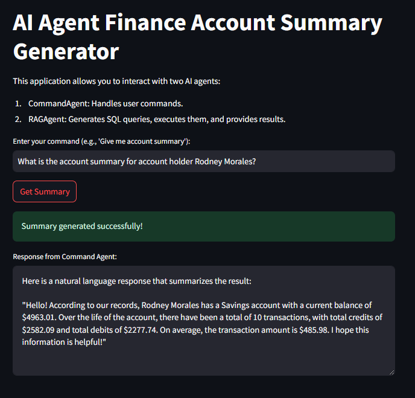

# Finance Project

This project demonstrates the use of AI agents using the AutoGen framework to handle commands and generate SQL-based responses. It is a complete pipeline from database setup, agent interaction, and UI integration using Streamlit.

---

## Project Structure
```
FINANCE_PROJECT
├── agents
│   ├── command_agent.py       # Command handling agent
│   ├── rag_agent.py           # RAG agent for SQL query generation and execution
├── data_creation
│   ├── aggregation.py         # Script for aggregating data
│   ├── create_table.py        # Script to create tables in the database
│   ├── generate_data.py       # Script to populate data
│   ├── verify_data.py         # Script to verify the data
├── finance_agent              # Conda environment location
├── .env                       # Environment variables file
├── app.py                     # Streamlit app script
├── finance.db                 # SQLite database file
├── groq_config.py             # Configuration for Groq API
├── main.py                    # Entry point for CLI-based interaction
├── README.md                  # Project documentation
├── requirements.txt           # Required Python packages
```

---

## Conda Commands

### 1. Create Environment
```bash
conda create -p finance_agent python==3.10 -y
```

### 2. Activate Environment
```bash
conda activate ./finance_agent
```

### 3. Install Required Packages
```bash
pip install -r requirements.txt
```
## `requirements.txt`
The `requirements.txt` file should contain:
```txt
faker
pandas
groq
python-dotenv
autogen-agentchat~=0.2
streamlit
```
---

## Explanation of Key Files

### `command_agent.py`
- This file defines the `CommandAgent` class.
- It handles user commands and forwards them to the `RAGAgent`.
- The `handle_request` method processes the user input, passes it to the `RAGAgent`, and returns the response.

### `rag_agent.py`
- This file defines the `RAGAgent` class.
- It acts as a Retrieval-Augmented Generation (RAG) agent to:
  1. Dynamically generate SQL queries based on user input using LLMs.
  2. Execute the queries on the SQLite database (`finance.db`).
  3. Summarize the query results into a user-friendly format.
- Key methods include:
  - `generate_dynamic_query`: Uses LLM to create SQL queries.
  - `execute_query`: Runs the SQL query on the database.
  - `summarize_result`: Converts database query results into natural language responses.


## Running the Project

### CLI Interaction
To interact with the agents via the terminal, run the `main.py` script:
```bash
python main.py
```
- Enter your commands, e.g., "Give me account summary".
- The output will be generated by the agents.

### Streamlit Interface
To launch the Streamlit app for a user-friendly interface:
```bash
streamlit run app.py
```
- Open the provided URL in your browser.
- Input your commands and view responses interactively.

---

## Sample Commands for Testing:

1. What is the account summary for account holder Rodney Morales?
2. Show the total number of transactions and average transaction amount for TOP 5 accounts?
3. What is the total debit and credit amount for account ID 88?
4. List all transactions above amount 500, grouped by saving account type?
5. Which account has the highest balance and how many transactions does it have?


## Streamlit UI

Below is a screenshot of the Streamlit UI for reference:


